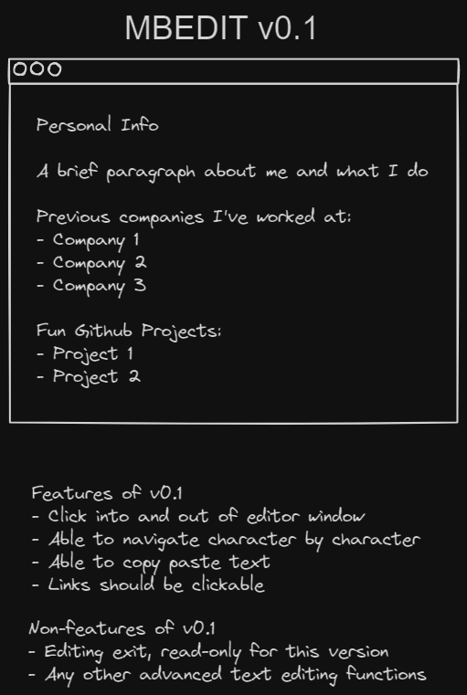

# MBEdit
A lightweight, web-based text editor built with TypeScript.

## Features

- Pure TypeScript implementation
- No JavaScript frameworks
- Simple and intuitive interface

## Mockup

## Getting Started

1. Clone the repository
2. TBD

## License

[MIT](https://choosealicense.com/licenses/mit/)